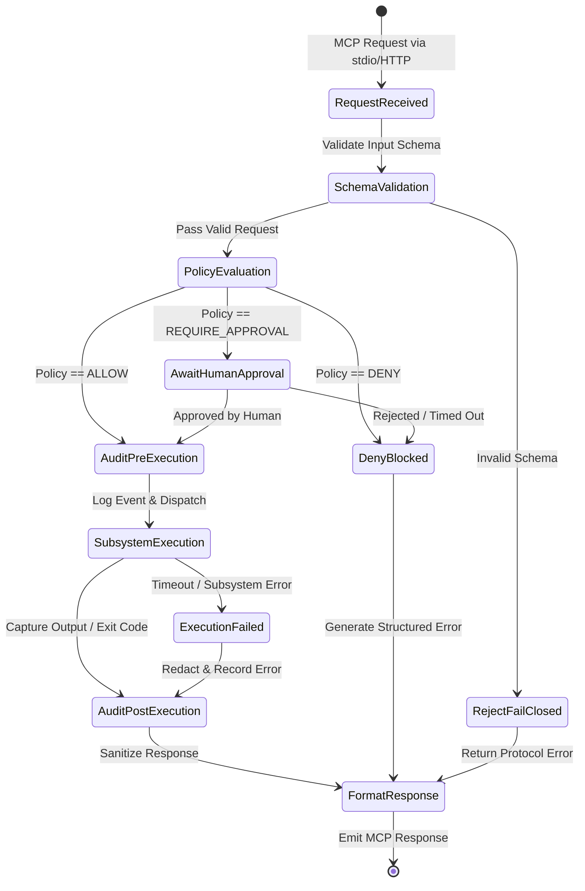

# Architecture Overview — CesSpace ARC

> **Document:** Architecture Specification
> **Status:** RC-00 Approved Baseline — RC-01 Active
> **Target Audience:** System Architects, Security Engineers, AI Agent Developers

---

## 1. Executive Summary & Mission

**CesSpace ARC** (Agent Remote Control) is a secure, vendor-neutral **agent-to-machine control plane** that establishes a hardened boundary between semi-autonomous AI coding agents and underlying host machines, virtual machines, and development environments.

Modern AI coding agents (such as Claude Code, Antigravity/AGY, OpenAI Codex, OpenCode, and DeepSeek-driven agents) require interaction with local development environments—inspecting files, searching codebases, running tests, reading diffs, and managing processes. However, granting autonomous agents direct, unrestricted access to a machine (such as open SSH keys, raw shell execution, or unrestricted filesystem access) creates unacceptable security risks, including:

- Arbitrary code execution and prompt-driven command injection.
- Secret exfiltration (`~/.ssh`, `~/.aws`, `.env`, environment variables).
- Accidental or malicious filesystem destruction (`rm -rf /`, overwriting critical configuration).
- Lateral movement across private networks.
- Supply chain poisoning and repository tampering.

**CesSpace ARC solves this problem by providing a mediation layer where every single agent action must pass through an authoritative policy engine, a rigorous security sandbox, and an append-only audit logger.**

---

## 2. High-Level Target Architecture

```
┌─────────────────────────────────────────────────────────────────────────────────────────┐
│                               AI Clients & Coding Agents                                │
│       (Claude Code / Antigravity / OpenAI Codex / OpenCode / DeepSeek Agents)          │
└────────────────────────────────────────────┬────────────────────────────────────────────┘
                                             │
                                             ▼
                               ┌───────────────────────────┐
                               │  Model Context Protocol   │  (JSON-RPC 2.0 / stdio / SSE)
                               │      (MCP Interface)      │
                               └─────────────┬─────────────┘
                                             │
═════════════════════════════════════════════╪═════════════════════════════════════════════
 TRUST BOUNDARY 1: Untrusted Network/Client │
═════════════════════════════════════════════╪═════════════════════════════════════════════
                                             ▼
                               ┌───────────────────────────┐
                               │    ARC Remote Gateway     │  (RC-05: Rate limiting, TLS,
                               │  & Authentication Engine  │   Device enrollment, Tokens)
                               └─────────────┬─────────────┘
                                             │
═════════════════════════════════════════════╪═════════════════════════════════════════════
 TRUST BOUNDARY 2: Authenticated Session     │
═════════════════════════════════════════════╪═════════════════════════════════════════════
                                             ▼
                               ┌───────────────────────────┐
                               │   Policy Engine Kernel    │  (RC-01: Minimal Security Kernel;
                               │    Precedence:            │   RC-04: Declarative Rules;
                               │ DENY > APPROVAL > ALLOW   │   Precedence: DENY > APPROVAL > ALLOW)
                               └─────────────┬─────────────┘
                                             │
                                             ▼
                               ┌───────────────────────────┐
                               │        Audit Layer        │  (RC-01: In-Memory/Stream Sink;
                               │   Redaction & Evidence    │   RC-06: Persistent/Anchored Log)
                               └─────────────┬─────────────┘
                                             │
═════════════════════════════════════════════╪═════════════════════════════════════════════
 TRUST BOUNDARY 3: Machine Plane Boundary   │
═════════════════════════════════════════════╪═════════════════════════════════════════════
                                             ▼
                               ┌───────────────────────────┐
                               │       ARC VM Agent        │  (Machine-local supervisor)
                               └─────────────┬─────────────┘
                                             │
               ┌─────────────────┬───────────┴─────┬─────────────────┐
               ▼                 ▼                 ▼                 ▼
        ┌──────────────┐  ┌──────────────┐  ┌──────────────┐  ┌──────────────┐
        │  Filesystem  │  │  Git Engine  │  │   Terminal   │  │  Processes   │
        │  Subsystem   │  │  Subsystem   │  │  Subsystem   │  │  Subsystem   │
        │(Jailed Roots)│  │(Branch Rules)│  │(Filtered PTY)│  │(Tree Superv.)│
        └──────────────┘  └──────────────┘  └──────────────┘  └──────────────┘
```

### The Mandatory Invariant

> **No Filesystem, Git, Terminal, or Process operation may ever execute without traversing the full Authentication -> Policy Engine -> Audit Layer pipeline.** Direct invocation of host APIs or shells by client code is architecturally impossible.

---

## 3. Architectural Layers & Security Pipeline Evolution

### 3.1. Minimal Security Kernel (RC-01 Foundation)

To honor the mandatory invariant from day one of operational code, RC-01 introduces a **Minimal Security Kernel** inside `packages/policy` and `packages/audit`:

- **Default-Deny Admission Gate:** All requests default to rejection unless matching explicit tool registration and authorized workspace context.
- **Explicit Read-Only Tool Allowlist:** Only the 9 designated read-only tools are exposed; any other tool call is denied at admission.
- **Canonical Workspace Binding:** Ensures all filesystem and Git operations are strictly pinned to pre-registered, canonical workspace roots.
- **Unified Policy Decision Pipeline:** All tool invocations flow through `evaluate()`.
- **Structured Audit Sink:** Every admission decision and execution event generates a structured `AuditRecord`.

In **RC-04**, this exact kernel is extended with configurable YAML rules, AST command classification, and human approval state machines. In **RC-06**, the audit sink is hardened with persistent append-only storage and cryptographic anchoring. There is no separate or secondary authorization mechanism.

### 3.2. MCP Interface (`packages/protocol`, `apps/mcp-server`)

- Exposes standardized tool definitions according to the Model Context Protocol (MCP) specification.
- Translates JSON-RPC requests into strongly typed internal command requests.
- Enforces request schema validation, input limits, and payload size bounds prior to dispatch.
- Emits structured, sanitized error responses that prevent information disclosure.

### 3.3. ARC Remote Gateway & Auth (`packages/auth`, RC-05)

- Manages mutual authentication between agent clients and the host execution daemon.
- Supports local stdio operation (inheriting user session privileges) and remote authenticated HTTPS/SSE connections.
- Implements device enrollment, token lifecycle management, and session pinning.
- Completely separates authentication ("who is the caller") from authorization ("what is the caller permitted to do").

### 3.4. Host Execution Subsystems (`packages/*`)

The host subsystems execute permitted actions within strict containment:

- **Filesystem Subsystem (`packages/filesystem`):** Canonicalizes all paths (`realpath`), verifies boundary containment, filters credential files (`~/.ssh`, `~/.aws`, `.env`), and leverages Linux descriptor-relative traversal (`openat2`) to mitigate TOCTOU races.
- **Git Subsystem (`packages/git`):** Provides safe repository inspection and controlled mutations while enforcing branch protection (denying direct commits/pushes to `main`).
- **Terminal Subsystem (`packages/terminal`):** Wraps command execution in an isolated process tree with execution timeouts, output buffer caps, and strict prohibition of root/sudo escalation.
- **Process Subsystem (`packages/processes`):** Tracks spawned child processes, enforces memory and CPU limits, and handles safe process termination.

---

## 4. Vendor Neutrality & Compatibility Matrix

CesSpace ARC is explicitly designed to remain independent of any single AI model vendor or cloud provider:

- **Protocol Neutrality:** Built entirely on open standards (MCP, JSON-RPC 2.0).
- **Client Agnostic:** Compatible with any standard MCP client (Codex, Claude Code, Antigravity, OpenCode, DeepSeek, custom agent loops).
- **Environment Agnostic:** Runs on Linux development VMs, containers, bare-metal developer workstations, and remote development hosts.
- **No Cloud-Specific Dependencies:** Does not require AWS, GCP, or Azure services to function; configuration is self-contained.

---

## 5. Architectural Lifecycle & State Machine


