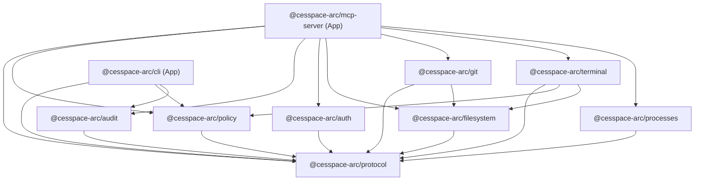

# Package Ownership & Dependency Architecture — CesSpace ARC

> **Document:** Repository Structure Specification
> **Status:** RC-00 Approved Baseline — RC-01 Active
> **Classification:** Architectural Governance

---

## 1. Monorepo Organization

CesSpace ARC is structured as a modular TypeScript monorepo managed by **pnpm workspaces** (`pnpm-workspace.yaml`), governed by strict package boundaries and unidirectional dependency flow.

```text
cesspace-arc/
├── apps/
│   ├── mcp-server/         # MCP protocol server (stdio & Streamable HTTP transports)
│   └── cli/                # Local CLI for administration, configuration, and inspection
│
├── packages/
│   ├── protocol/           # Core MCP tool schemas, JSON-RPC types, error definitions
│   ├── policy/             # Policy Engine, rule evaluator, permission matrices
│   ├── audit/              # Append-only structured audit logger & redaction engine
│   ├── auth/               # Identity verification, session tokens, device enrollment
│   ├── filesystem/         # Canonical path resolution, jailing, file inspection/mutation
│   ├── git/                # Sandboxed Git operations & branch protection rules
│   ├── terminal/           # Controlled process runner, timeout supervisor, stream limiter
│   └── processes/          # Host process inspector, cancellation, and tree supervisor
│
├── docs/                   # Architecture specs, threat model, ADRs
├── examples/               # Sanitized example policies and configuration
├── scripts/                # Verification, secret scanning, and build scripts
└── tests/                  # Cross-package integration and contract tests
```

---

## 2. Package Responsibilities & Boundaries

All packages and applications are marked `"private": true` during initial development stages until an explicit future publishing release candidate. Internal workspace linkages use pnpm's `workspace:*` dependency protocol.

### 2.1. `packages/protocol`

- **Role:** Pure data contracts, interfaces, and serialization formats.
- **Dependencies:** None (zero runtime dependencies).
- **Contents:** MCP tool argument and result interfaces, JSON-RPC 2.0 error schemas, audit record interfaces, and canonical policy context types.

### 2.2. `packages/policy`

- **Role:** Central authorization engine (Minimal Security Kernel in RC-01; Declarative Engine in RC-04).
- **Dependencies:** `@cesspace-arc/protocol`.
- **Contents:** Rule parser, evaluation pipeline, precedence resolver (`DENY > APPROVAL > ALLOW`), path matchers, command classifiers, and approval state machines.
- **Invariant:** Must remain independent of host execution drivers. Evaluates abstract operations against context.

### 2.3. `packages/audit`

- **Role:** Security event recording and evidence collection (Stream Sink in RC-01; Anchored Persistence in RC-06).
- **Dependencies:** `@cesspace-arc/protocol`.
- **Contents:** Append-only log writer, automated regex/entropy secret redaction pipeline, hash-chaining integrity generator, and evidence packager.

### 2.4. `packages/auth`

- **Role:** Identity, session, and device authentication.
- **Dependencies:** `@cesspace-arc/protocol`.
- **Contents:** Session token issuance and verification, device enrollment, certificate pinning, and stdio credential validation.

### 2.5. `packages/filesystem`

- **Role:** Jailed filesystem operations.
- **Dependencies:** `@cesspace-arc/protocol`.
- **Contents:** Canonical path resolver (`realpath`), symlink escape detector, sensitive path blacklist filter, bounded file reader, and directory walker.

### 2.6. `packages/git`

- **Role:** Controlled Git operations.
- **Dependencies:** `@cesspace-arc/protocol`, `@cesspace-arc/filesystem`.
- **Contents:** Safe Git command invoker (argument-vector based), working tree status parser, diff generator with buffer bounds, log reader, and protected branch mutability guard.

### 2.7. `packages/terminal`

- **Role:** Policy-supervised command execution.
- **Dependencies:** `@cesspace-arc/protocol`, `@cesspace-arc/policy`, `@cesspace-arc/filesystem`.
- **Contents:** Subprocess spawner (`execve` without `/bin/sh`), execution timeout manager, output stream buffer limiter, non-root user enforcement, and environment sanitizer.

### 2.8. `packages/processes`

- **Role:** Process tracking and tree supervision.
- **Dependencies:** `@cesspace-arc/protocol`.
- **Contents:** Process table inspector (filtering to control plane child processes), process termination (`SIGTERM`/`SIGKILL`), and resource limit monitors.

### 2.9. `apps/mcp-server`

- **Role:** MCP server runtime.
- **Dependencies:** All `packages/*` via `workspace:*`.
- **Contents:** Transport listeners (UNIX stdio and Streamable HTTP over TLS 1.3 with SSE response framing), tool registration, request dispatcher, error serialization, and startup lifecycle management.

### 2.10. `apps/cli`

- **Role:** Human developer and administrative interface.
- **Dependencies:** `@cesspace-arc/protocol`, `@cesspace-arc/policy`, `@cesspace-arc/audit` via `workspace:*`.
- **Contents:** CLI commands to inspect audit logs, approve pending operations (`arc approve <id>`), test policies (`arc policy test`), and verify environment health.

---

## 3. Dependency Directed Acyclic Graph (DAG)



### Architectural Dependency Invariants

1. **Zero Upward Dependencies:** Lower-level packages (`protocol`, `filesystem`, `policy`, `audit`) may never import from higher-level packages (`git`, `terminal`, `apps/*`).
2. **Zero Circular References:** Monorepo package cycles are strictly prohibited and verified by static analysis.
3. **Protocol Independence:** `packages/protocol` has zero internal or external dependencies beyond Node.js built-in primitives.
