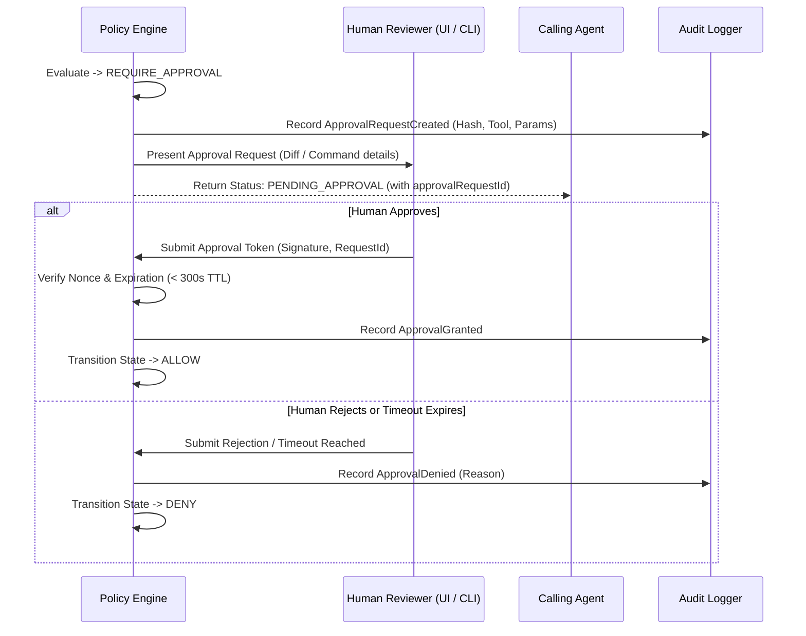

# Permission & Policy Model — CesSpace ARC

> **Document:** Security & Policy Specification
> **Status:** RC-00 Approved Baseline
> **Classification:** Core Security Mechanism

---

## 1. Overview & Architectural Role

The **CesSpace ARC Policy Engine** (`packages/policy`) is the central authorization authority of the control plane. Every tool invocation crossing into the machine execution domain must be evaluated and authorized by this engine.

The policy model is strictly declarative, deterministic, and fail-closed.

---

## 2. Policy Outcomes & Absolute Precedence

Every policy evaluation terminates in exactly one of three discrete outcomes:

```text
    ┌─────────────────────────┐
    │       DENY (0)          │  Highest Precedence (Blocks immediately)
    └────────────┬────────────┘
                 ▼
    ┌─────────────────────────┐
    │  REQUIRE APPROVAL (1)   │  Medium Precedence (Suspends for human approval)
    └────────────┬────────────┘
                 ▼
    ┌─────────────────────────┐
    │       ALLOW (2)         │  Lowest Precedence (Proceeds to execution)
    └─────────────────────────┘
```

### 2.1. The Absolute Precedence Rule
> **`DENY > REQUIRE APPROVAL > ALLOW`**

If multiple policy rules match a requested operation, the most restrictive rule wins:
- If any matching rule evaluates to `DENY`, the operation is **immediately blocked**, regardless of whether other rules would allow or require approval.
- If a rule requires approval and no rule denies, the operation is **suspended pending human authorization**.
- Only when all matching rules evaluate to `ALLOW` (and zero rules evaluate to `DENY` or `REQUIRE APPROVAL`) may the operation execute automatically.
- If no rules match the request, the engine applies the **Default Deny** rule and terminates the request with `DENY`.

---

## 3. Classification of Operations

Operations and tools are categorized into three policy classes:

### 3.1. `ALLOW` Operations (Automatic Execution)
Safe, idempotent, read-only inspection operations confined entirely within approved workspace roots:
- `health` check.
- `list_directory` within approved roots.
- `read_file` within approved roots (excluding blacklisted paths).
- `search_files` and `search_text`.
- `git_status`, `git_diff`, `git_log` on approved repositories.
- `system_status` (sanitized host metrics).
- Pre-approved safe read-only commands (e.g. `npm test --dry-run`, `tsc --noEmit`).

### 3.2. `REQUIRE APPROVAL` Operations (Human-in-the-Loop)
Operations that modify repository state, alter files, create executables, or run non-trivial builds:
- `write_file` or `create_file`.
- `apply_patch`.
- `git commit` or checkout of feature branches.
- `run_command` for test suites, build scripts, linters, or compilers.
- Package installation (`npm install`, `cargo build`).
- Creating executable binaries or scripts.

### 3.3. `DENY` Operations (Permanently Blocked)
Dangerous, destructive, or privilege-escalating operations that are strictly prohibited in public/default environments:
- Superuser / administrative commands (`sudo`, `su`, `pkexec`, `doas`).
- Shell escalation or opening interactive root shells (`/bin/sh`, `/bin/bash` without args).
- Recursive deletions targeting host directories (`rm -rf /`, `rm -rf ~`).
- Reading credential stores: `~/.ssh/*`, `~/.aws/*`, `~/.gnupg/*`, `~/.kube/*`, `/etc/shadow`.
- Accessing or modifying files outside approved workspace roots.
- Mutating protected Git branches (`git push origin main`, `git checkout -B main`, `git reset --hard origin/main`).
- Modifying Git security internals (`.git/hooks/`, `.git/config`).
- Production cloud root or database access.
- System-level reboot, poweroff, or network interface reconfiguration.

---

## 4. Evaluation Context & Context Attributes

The Policy Engine evaluates requests against an evaluation context tuple:

```typescript
interface PolicyEvaluationContext {
  actor: {
    id: string;              // Client / Agent identifier
    clientType: string;      // e.g. "antigravity", "claude-code", "codex"
    authenticated: boolean;  // Must be true
  };
  targetWorkspace: {
    rootPath: string;        // Canonical absolute path of approved workspace
    isGitRepo: boolean;      // True if workspace is a git repo
  };
  request: {
    toolName: string;        // e.g. "read_file", "run_command"
    parameters: Record<string, unknown>; // Tool arguments
  };
  environment: {
    timestamp: string;       // ISO 8601 evaluation timestamp
    sessionDurationMs: number;
  };
}
```

### Contextual Matching Rules
1. **Workspace Boundary Matching:** The requested path is canonicalized. If the path does not reside under `targetWorkspace.rootPath`, the match result is automatically `DENY`.
2. **Command Pattern Matching:** For execution tools, the command binary and arguments are matched against regular expressions and exact token lists. Shell metacharacters are forbidden.
3. **Branch Target Matching:** For Git tools, target refs are parsed. If the target ref matches protected branch patterns (`refs/heads/main`, `refs/heads/master`, `refs/heads/release/*`), the result is `DENY`.

---

## 5. Human-in-the-Loop Approval Workflow

When an operation evaluates to `REQUIRE APPROVAL`, the execution pipeline executes the following protocol:



### Approval Constraints
1. **Payload Hash Binding:** The approval token is bound cryptographically to the SHA-256 hash of the exact tool arguments. Any variation in arguments invalidates the approval.
2. **Time-To-Live (TTL):** Approvals expire after 300 seconds (5 minutes) if not executed.
3. **One-Time Use:** An approval token is consumed upon execution and cannot be replayed.
4. **No Ambient Approval:** Approving one tool invocation does not grant blanket permission for subsequent invocations.

---

## 6. Policy Specification Schema (YAML)

Policies are expressed in structured YAML:

```yaml
version: "1.0"
metadata:
  name: "default-development-policy"
  description: "Standard secure sandbox policy for development VMs"

workspaces:
  - id: "primary-repo"
    path: "/home/cespr/cesspace-arc"
    allowSymlinksOutside: false

rules:
  # 1. Deny rules (Highest precedence)
  - id: "deny-credentials"
    effect: "DENY"
    description: "Block access to all credentials and secret stores"
    paths:
      patterns:
        - "**/.ssh/**"
        - "**/.aws/**"
        - "**/.gnupg/**"
        - "**/.env*"
        - "**/id_rsa*"

  - id: "deny-destructive-commands"
    effect: "DENY"
    description: "Block administrative and destructive system commands"
    commands:
      blockedBinaries:
        - "sudo"
        - "su"
        - "pkexec"
        - "shutdown"
        - "reboot"
        - "mkfs"
        - "dd"

  - id: "deny-protected-branches"
    effect: "DENY"
    description: "Prevent direct mutation of protected Git branches"
    git:
      protectedBranches:
        - "main"
        - "master"
        - "release/*"

  # 2. Require approval rules
  - id: "approval-source-writes"
    effect: "REQUIRE_APPROVAL"
    description: "All file writes and patch applications require operator approval"
    tools:
      - "write_file"
      - "create_file"
      - "apply_patch"

  - id: "approval-test-execution"
    effect: "REQUIRE_APPROVAL"
    description: "Executing build or test commands requires approval"
    tools:
      - "run_command"

  # 3. Allow rules (Lowest precedence)
  - id: "allow-safe-reads"
    effect: "ALLOW"
    description: "Allow reading and inspecting files within authorized root"
    tools:
      - "health"
      - "list_directory"
      - "read_file"
      - "search_files"
      - "search_text"
      - "git_status"
      - "git_diff"
      - "git_log"
      - "system_status"
```
