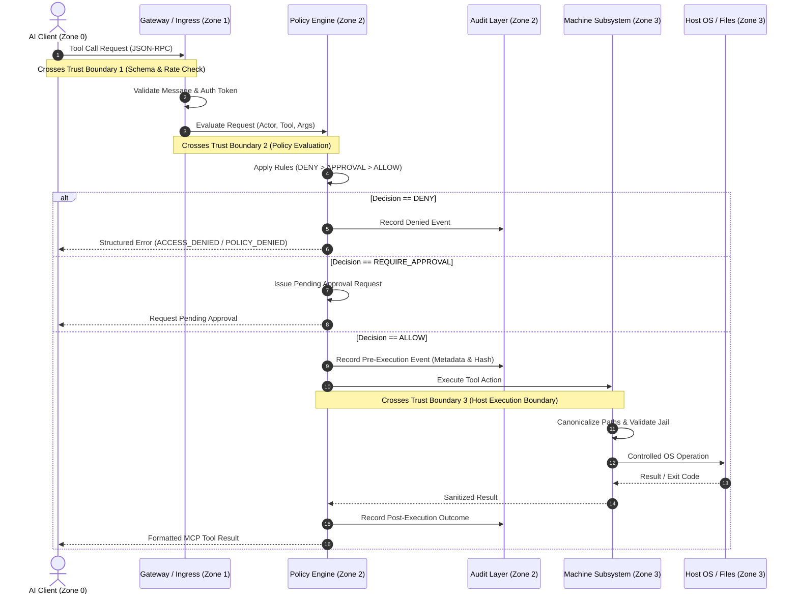

# Trust Boundaries — CesSpace ARC

> **Document:** Security Specification
> **Status:** RC-00 Approved Baseline — RC-01 Active
> **Classification:** Security Architecture

---

## 1. Overview of Trust Boundaries

In traditional development environments, an agent or script often runs directly within the user's shell session, possessing the full ambient authority of the logged-in user. This creates a single flat security domain where any prompt injection, buggy model output, or compromised tool can access credentials, corrupt source trees, or establish backdoors.

CesSpace ARC partitions the system into **four distinct security zones separated by three explicit trust boundaries**. Ambient authority is completely eliminated; every interaction must cross boundaries via hardened, verifiable interfaces.

```
┌────────────────────────────────────────────────────────────────────────────────────────┐
│ ZONE 0: UNTRUSTED CLIENT DOMAIN                                                        │
│ - External AI Agents (Claude Code, Antigravity, Codex, DeepSeek, OpenCode)             │
│ - Third-party MCP clients, IDE plugins, terminal extensions                            │
│ - Potential Vector: Prompt Injection, Malicious Tool Calling, Payload Manipulation    │
└───────────────────────────────────────────┬────────────────────────────────────────────┘
                                            │
  ══════════════════════════════════════════╡ TRUST BOUNDARY 1 (Ingress & Protocol Boundary)
                                            ▼
┌────────────────────────────────────────────────────────────────────────────────────────┐
│ ZONE 1: CONTROL PLANE INGRESS & IDENTITY DOMAIN                                        │
│ - Transport termination (JSON-RPC stdio or HTTPS/WSS SSE)                              │
│ - Request schema validation and size/rate limiting                                     │
│ - Cryptographic identity verification & session token validation (packages/auth)       │
└───────────────────────────────────────────┬────────────────────────────────────────────┘
                                            │
  ══════════════════════════════════════════╡ TRUST BOUNDARY 2 (Policy & Decision Boundary)
                                            ▼
┌────────────────────────────────────────────────────────────────────────────────────────┐
│ ZONE 2: POLICY ENFORCEMENT & AUDIT DOMAIN                                              │
│ - Authoritative Policy Engine (RC-01: Minimal Security Kernel; RC-04: Declarative)    │
│ - Precedence Rule: DENY > REQUIRE APPROVAL > ALLOW                                     │
│ - Approval token issuance and verification                                             │
│ - Structured audit logger with data minimization & redaction (packages/audit)          │
└───────────────────────────────────────────┬────────────────────────────────────────────┘
                                            │
  ══════════════════════════════════════════╡ TRUST BOUNDARY 3 (Host Execution Boundary)
                                            ▼
┌────────────────────────────────────────────────────────────────────────────────────────┐
│ ZONE 3: MACHINE EXECUTION DOMAIN                                                       │
│ - Local VM agent supervisor                                                            │
│ - Filesystem jail (canonicalized paths, symlink checks, descriptor-relative traversal) │
│ - Git execution supervisor (branch immutability, sanitized git invocations)            │
│ - Process supervisor (execution timeouts, memory caps, non-root execution)             │
└────────────────────────────────────────────────────────────────────────────────────────┘
```

---

## 2. Trust Boundary Detailed Analysis

### Trust Boundary 1: Client Ingress & Protocol Boundary

**Separates:** Zone 0 (Untrusted Client) from Zone 1 (Control Plane Ingress).

- **Threat Profile:**
  - Flooding / Denial of Service via massive JSON-RPC payloads.
  - Malformed protocol messages designed to crash or exploit parsers.
  - Impersonation or session hijacking.
  - Parameter tampering (e.g., injecting shell metacharacters into JSON fields).
- **Defensive Controls:**
  1. **Strict Transport Layer:** All remote connections require TLS 1.3 with pinned certificates. Local connections use non-networked UNIX stdio pipes.
  2. **Schema Validation:** Strict JSON schema validation on every message before parsing domain logic. Any extra or unexpected fields trigger rejection.
  3. **Payload Bounds:** Hard ceiling on JSON-RPC message size (default: 4 MB). Any oversized frame is dropped at the transport boundary.
  4. **Rate Limiting:** Sliding-window rate limiter per client session preventing automated abuse or denial-of-service loops.
  5. **Authentication Verification:** Cryptographic session tokens are validated prior to routing to the policy engine.

---

### Trust Boundary 2: Policy & Decision Boundary

**Separates:** Zone 1 (Control Plane Ingress) from Zone 2 (Policy Enforcement & Audit).

- **Threat Profile:**
  - Bypassing policy checks via logic flaws or race conditions.
  - Confused deputy attacks where a valid tool call acts on an unauthorized resource.
  - Agent attempting to alter policy rules or tamper with authorization state.
  - Inadvertent leaking of credentials into audit trails or error messages.
- **Defensive Controls:**
  1. **Policy Engine Monopoly:** Subsystem execution layers cannot be invoked directly; they accept requests exclusively via internal programmatic dispatch from the Policy Engine kernel.
  2. **Default Deny Evaluation:** In the absence of an explicit `ALLOW` rule matching the exact actor, workspace, tool, and parameters, the outcome is `DENY`.
  3. **Strict Precedence:** If any rule evaluates to `DENY`, the request is terminated immediately, overriding any matching `ALLOW` or `REQUIRE APPROVAL` rules.
  4. **Approval Binding:** For `REQUIRE APPROVAL` outcomes, execution pauses until an authenticated human operator approves the exact request payload. Approvals are one-time use, time-bounded (TTL 5 minutes), and bound to the specific payload hash.
  5. **Mandatory Audit Dispatch:** Every evaluation decision (allow, deny, approval requested, approved, rejected) is written to the audit pipeline before subsystem dispatch.

---

### Trust Boundary 3: Host Execution Boundary

**Separates:** Zone 2 (Policy Enforcement & Audit) from Zone 3 (Machine Execution Domain).

- **Threat Profile:**
  - Path traversal attacks (`../../etc/passwd`, `%2e%2e%2f`).
  - Symlink attacks (creating symlinks pointing to `/root`, `/home/user/.ssh`, or `/etc`).
  - Hardlink aliasing bypassing path prefix checks.
  - Command injection via subshells, shell metacharacters (`|`, `&`, `;`, `$()`), or argument injection.
  - Privilege escalation (running `sudo`, abusing SUID binaries, interacting with `/var/run/docker.sock`).
  - Direct modification of protected Git branches (`main`, `master`) or tampering with Git internals (`.git/hooks/`, `.git/config`).
- **Defensive Controls:**
  1. **Filesystem Canonicalization & Jailing:** Every requested path is resolved to its real canonical path using `realpath()` on the host. The resolved path must strictly reside within the approved workspace root directory.
  2. **Linux Descriptor Traversal (`openat2`):** Child paths are resolved relative to the workspace root directory file descriptor with `RESOLVE_BENEATH` to eliminate parent-component TOCTOU symlink races.
  3. **Secret Path Blacklist:** Paths matching known secret locations (`~/.ssh`, `~/.aws`, `~/.gnupg`, `~/.config`, `/etc`, `/proc`, `/sys`, `.env`) are blocked at the path resolver level, even if located inside a workspace.
  4. **Non-Root Execution:** Subprocesses run strictly under the unprivileged user account. Invocation of `sudo`, `su`, `pkexec`, or setuid binaries is filtered and denied.
  5. **Direct Execution Without Shell:** Terminal commands are executed using direct `execve`-style argument vectors (`argv[]`) rather than passing raw strings to `/bin/sh -c`, completely eliminating shell injection vulnerabilities.
  6. **Resource Sandboxing:** Commands are executed under supervision with aggressive timeouts (e.g., 30s default), maximum memory limits, and strict process tree tracking to eliminate fork bombs and zombie processes.

---

## 3. Boundary Crossing Sequence Diagram


